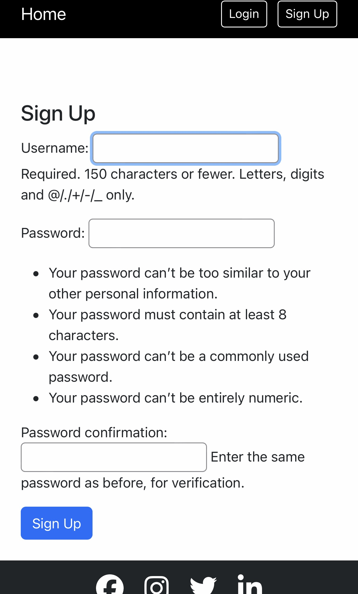
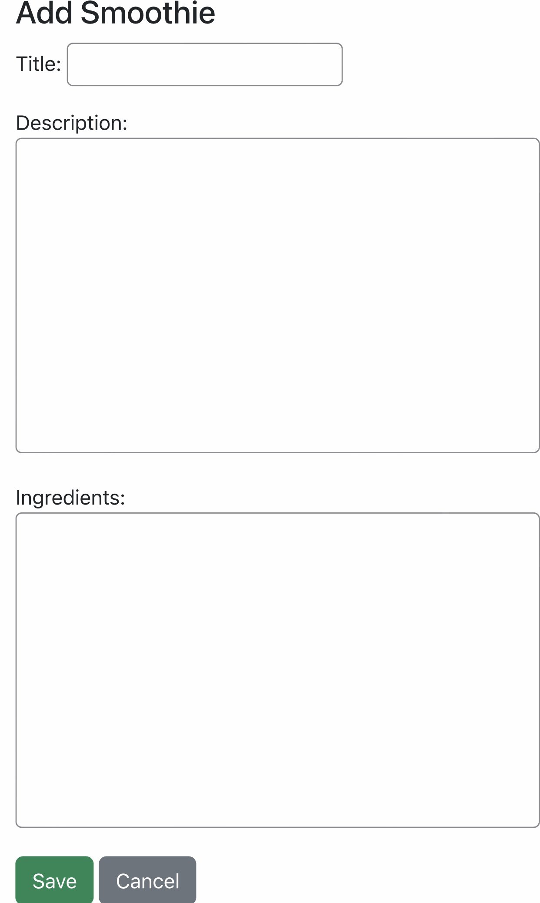
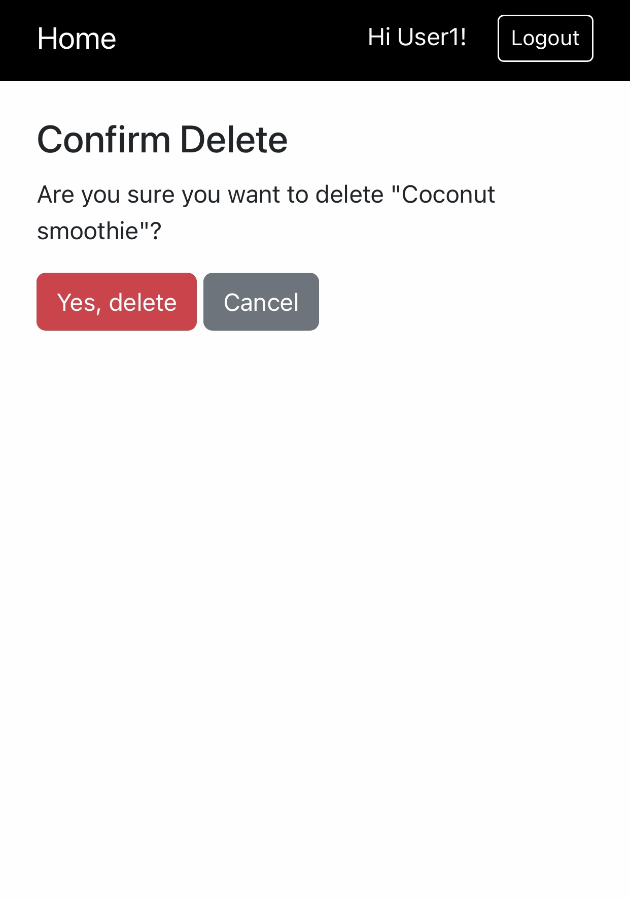
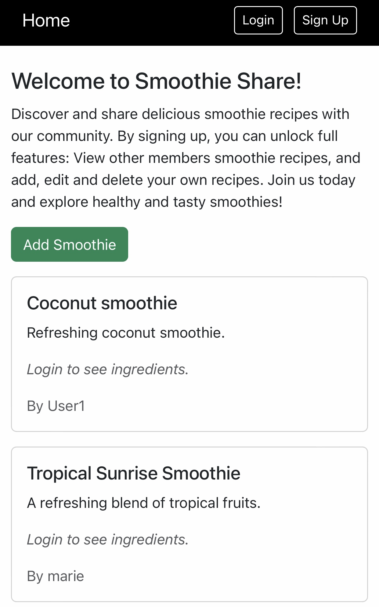
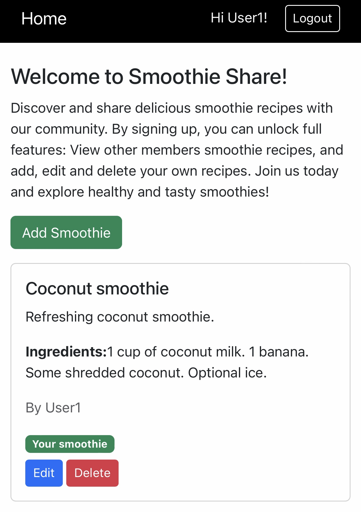
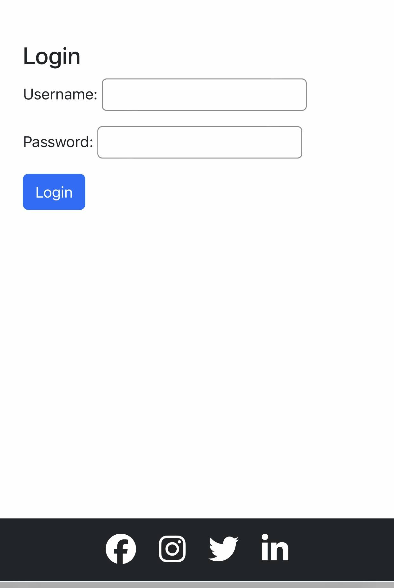

# smoothie_p3_app

View here:[Smoothie Share P3 App](https://smoothie-p3-app-880029449dda.herokuapp.com/)

## Description

The Smoothie Share Recipe app is a web application where users can create, share, and find smoothie recipes. It is user friendly, and its easy navigation means users can easily sign up or login. When logged in users can add new smoothies Users can only add, edit and delete their own recipes when logged in. They can not change other users recipes. Smoothie ingredients are shown for logged in users. Non-logged in users will see a prompt to log in. This will encourage people to sign up.

## Project requirments

The project requirements are to create and deploy a data centric web application using Django. Users must be able to log in and perform CRUD operations, Create, Read, Update and Delete. The site should be user friendly and responsive. It must be deployed on Heroku.

## User stories

| User Story | Requirement Met | Implementation | Screenshot |
|------------|----------------|----------------|------------|
| As a user, I want to create an account easily so that I can access the website's features. | Signup form | Users can create an account through a sign-up form. Once submitted and validated, the user is logged in and can view and add smoothie recipes. |  |
| As a user, I want to add my smoothie recipes so I can share them with other users. | Smoothie creation form | Users can add smoothie recipes via a form to input the title, description, and ingredients. |  |
| As a user, I want to edit my smoothie recipes. | Edit functionality | Users can edit only the smoothie recipes they created. |  |
| As a user, I want to delete my smoothie recipes. | Delete functionality | Users can delete only the recipes they created. |  |

## Features

- **User Authentication** – Users can sign up, log in, and log out.  
- **CRUD Operations** – Users can create, view, edit, and delete their smoothie recipes.  
- **Smoothie List** – View all smoothies shared by other users.  
- **Access Control** – Only the user who created a smoothie recipe can edit or delete it.  
- **Ingredient Visibility** – Only logged-in users can see smoothie ingredients, encouraging non-members to sign up.  

## Future Features

- **User Profiles** – A profile page for each user.  
- **Recipe Images** – Users can upload images for their smoothie recipes.  
- **Saved Recipes** – Users can save other users smoothie recipes to their profile.  
- **Ratings & Comments** – Users can rate and comment on other users recipes.  
- **UI/UX Improvements** – Enhance overall design and user experience of the application.  

## Design

The design of the Smoothie Share app focuses on clarity and accessibility with a modern and minimalist layout. It is kept simple with a strong contrast between black and white, making the content easy to read while the buttons have colour to make key actions stand out.

 

 

### Database Schema

User ( Django default ):

| Field        | Type       | Purpose                                |
| ------------ | ---------- | -------------------------------------- |
| id           | Integer    | Unique identifier for each user        |
| username     | CharField  | Used for user authentication           |
| email        | EmailField | Stores the user’s email address        |
| password     | Hashed     | Securely stores the user’s password    |
| is_staff     | Boolean    | Allows access to the admin panel       |
| is_superuser | Boolean    | Grants full administrative permissions |

Smoothie model:

| Field        | Type              | Purpose                                       |
| ------------ | ----------------- | --------------------------------------------- |
| id           | Integer           | Unique identifier for each smoothie           |
| title        | CharField         | Name of the smoothie recipe                   |
| description  | TextField         | Description of the smoothie                   |
| ingredients  | TextField         | Ingredients required for the smoothie         |
| author       | ForeignKey (User) | Links the smoothie to the user who created it |
| date_created | DateTimeField     | Automatically stores the creation date        |

### Colour Scheme

| Element | Colour | Purpose | 
|------------|----------------|----------------|
| Navbar background | Black (#000000)  | Strong contrast, clean and modern look. | 
| Navbar text and buttons | White (#FFFFFF) | High readability against black. | 
| Footer background |  Black (#000000) | Matches the Navbar. |  
| Page background | White (#FFFFFF) | Clean and makes the content easy to read. | 

### Button Styling

| Element | Colour | Purpose | 
|------------|----------------|----------------|
| Add Smoothie  | Green  | Indicates a positive action. | 
| Edit button | Blue | Standard action for editing content. | 
| Delete button | Red | Brings attention to a destructive action. | 

### Typography

* Primary Font: Montserrat from Google Fonts.

* Fallback Font: sans-serif for Montserrat in case it doesn't load.

* Montserrat is clean and great for readability. It complements the minimalist colour of the website.

### Wireframe

You can view the wireframes for both mobile and larger screens [here](docs/wireframes.md)

## Technologies used

## Tools used

## Deployment

## Testing

### Lighthouse Reports

### W3C Markup Validation

### W3C CSS Validator

### Manual Testing

| Feature | Test Action | Expected Result | Actual Result | Pass/Fail |
|--------|------------|-----------------|---------------|-----------|
| Sign up form. | User completes the sign-up form with valid details. | User account is created. | Works as expected. | Pass. |
| Login. | User enters valid login credentials. | User is logged in and redirected to homepage. | Works as expected. | Pass. |
| Add smoothie recipe. | Logged-in user submits a new smoothie recipe. | Recipe is created and displayed on the site. | Works as expected. | Pass. |
| Save smoothie recipe. | Logged-in user saves their smoothie. | Recipe is stored and visible. | Works as expected. | Pass. |
| Edit smoothie recipe. | Logged-in user edits their own smoothie. | Updated recipe is saved and displayed. | Works as expected. | Pass. |
| Delete smoothie recipe. | Logged-in user deletes their own smoothie. | Recipe is removed from the site. | Works as expected. | Pass. |
| View other users smoothies. | Logged-in user views other users smoothie ingredients. | Smoothie ingredients are visible. | Works as expected. | Pass. |
| Logout. | Logged-in user clicks logout. | User is logged out and redirected. | Works as expected. | Pass. |

### Responsive Design Testing

The Home page was tested for responsiveness using browser developer tools. Testing was carried out on, mobile, tablet and desktop screen sizes. On Chrome, Edge and Firefox browsers.
The layout adapts correctly across all tested screen sizes and browsers.  
Find the screenshots of the responsive testing here: [Responsive Testing Screenshots](docs/responsivescreen/responsive_testing.md).

**Features:**

## Bugs and Fixes

| Bug | Cause | Solution | Result |
|-----|-------|---------|--------|
| CSS test page (/css_test/) returned 404 and CSS did not load. | URL path mismatch in Django routing (css_test/ vs /css-test/). | Fixed smoothies/urls.py to use path(css_test/, views.css_test, name=css_test); ensured base.html loads static CSS and style.css exists in static/css/. | Page loads successfully and CSS background-color is applied. |
|  |  |  | |
| Server failed to start when loading smoothie views. | SmoothieForm was imported in views.py before forms.py existed in the smoothies app. | Created forms.py in the correct app directory and defined SmoothieForm. | Server starts successfully and smoothie views loads correctly. |
|  |  |  | |
| Footer was in the middle of the page. | Page layout did not push footer to the bottom of the page.  | Added flex layout to body and main in CSS. | Footer stays at the bottom of the page. |
|  |  |  | |
| Testing add smoothie while not logged in caused 404. | LOGIN_URL not set in settings.py.  | Added LOGIN_URL = '/login/' in settings.py. | Non logged in users are now redirected to the login page. |
|  |  |  | |
| Navbar and footer disappeared when preparing for deployment. | STATICFILES_FILES pointed to the wrong static directory.  | Updated STATICFILES_DIRS to reference the root static folder. | CSS loads correctly and navbar and footer display as expected. |
|  |  |  | |
| App crashed on deployment. | Database not migrated on Heroku.  | Configured database for Heroku, added postgreSQL and ran migrations. | App loads successfully. |
|  |  |  | |
| 500 error page. | Tables not created in production.  | Applied migrations. | Pages display correctly. |
|  |  |  | |
| Python version mismatch on Heroku. | Heroku default Python version.  | Specified Python version. | Heroku uses correct Python version. |
|  |  |  | |
| Favicon not showing. | Favicons were not in staticfiles used in deployment and the wrong link was in base.html.  | Added .ico link in base.html, ran collectstatic, merged and pushed changes . | Favicon now displays. |
|  |  |  | |

## Credits

**Youtube tutorial Django Recipe Sharing Tutorial by Dom Vacchiano. I used this video as a guide along with my own code, some python conventions and patterns used are 
  similar.**

[See video here](https://www.youtube.com/watch?v=w7EJu9Gd5Ns&list=PLQbt1tI_yQHg5HYpdUqit1wkc4BOPTkpx&index=1)

---

**Youtube tutorial Django Recipe Sharing Tutorial by Dee Mc. I used as a guide with my own code, some python conventions and patterns used are similar.**

[See video here](https://www.youtube.com/watch?v=sBjbty691eI&list=PLXuTq6OsqZjbCSfiLNb2f1FOs8viArjWy)

---

**Google Fonts:**

**Canva:**

**Favicon:**

**Font Awsome:**
